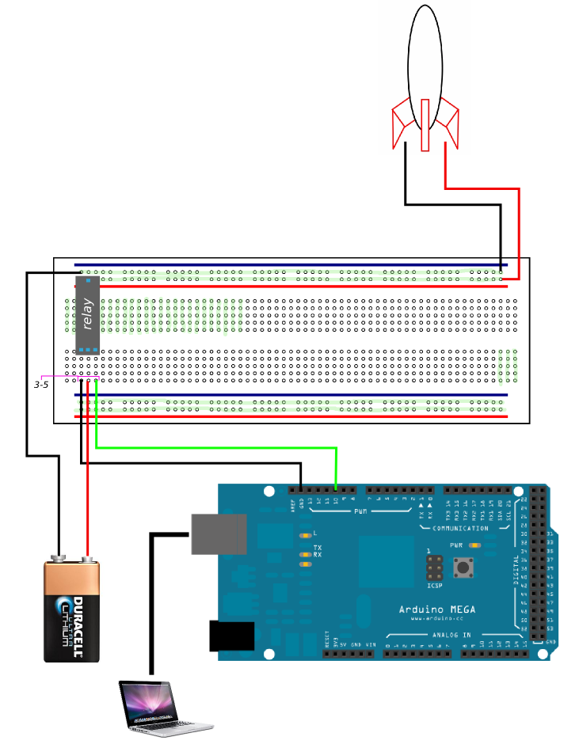

###What you'll need
  - [Nodejs](http://nodejs.org)
  - [Python 2.7.x](https://www.python.org/downloads/windows) (Windows)
  - Arduino microcontroller board. You can get one at Radio Shack for ~$35
  - Bread board
  - A [rocket](http://www.estesrockets.com/rockets) an a few [engines](http://www.estesrockets.com/rockets/engines/standard/1614-c6-5)
  - 9V batteries

###How to
1. Connect wires as seen in schematic
1. Open Terminal/Command Prompt
2. cd /dir/to/rockets
3. npm install 
4. node launch.js
5. blastoff

